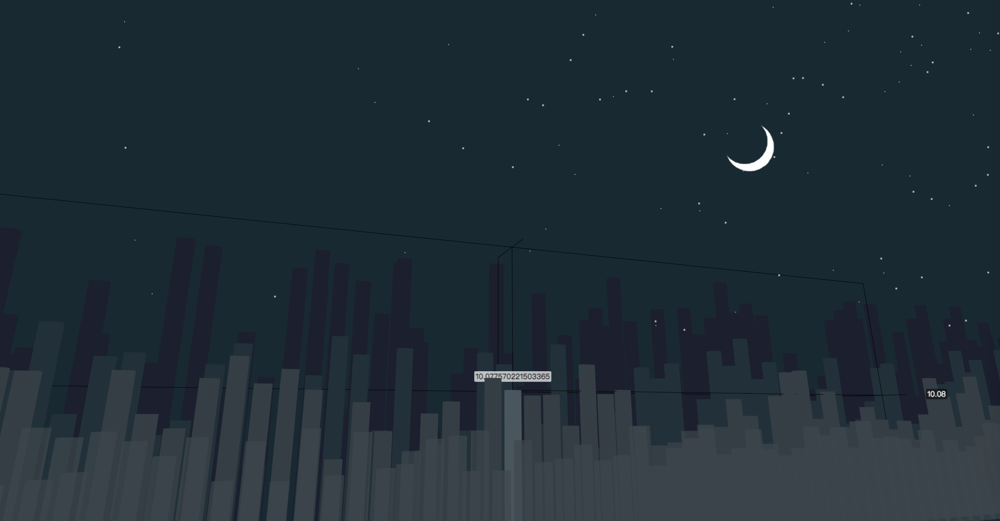
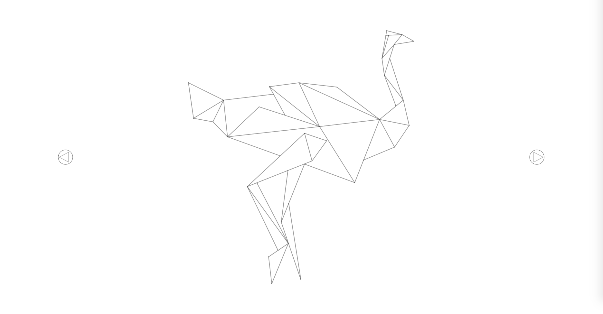
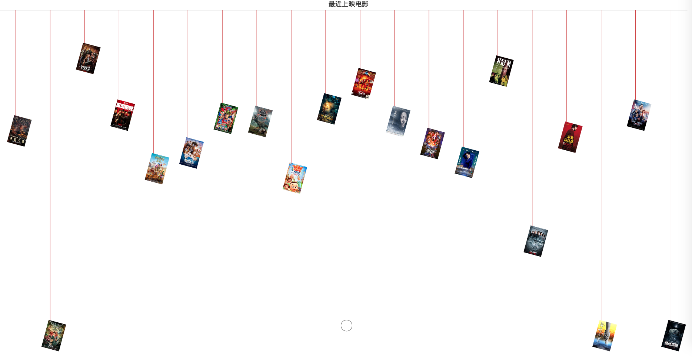
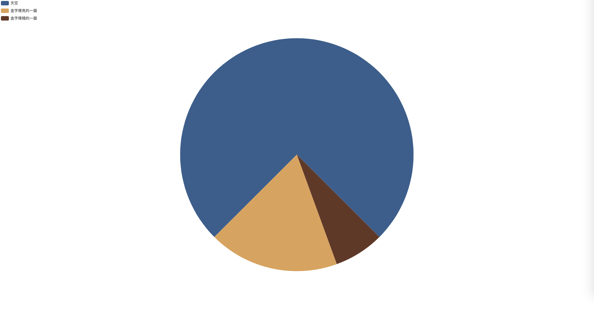
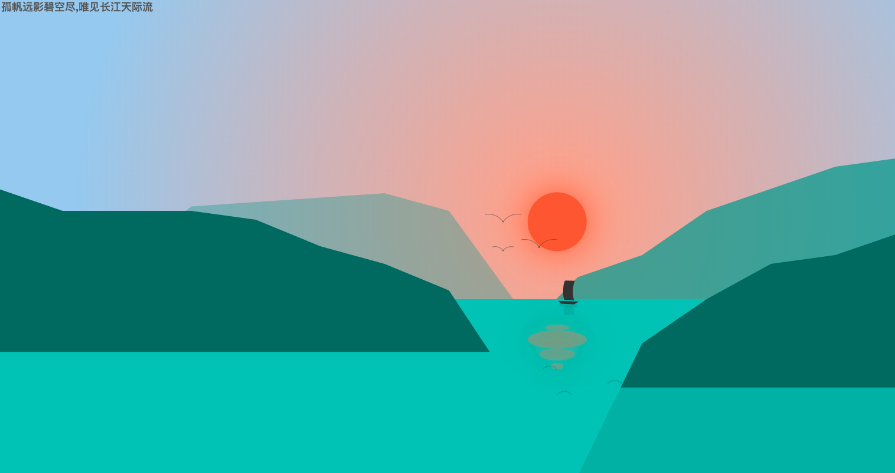
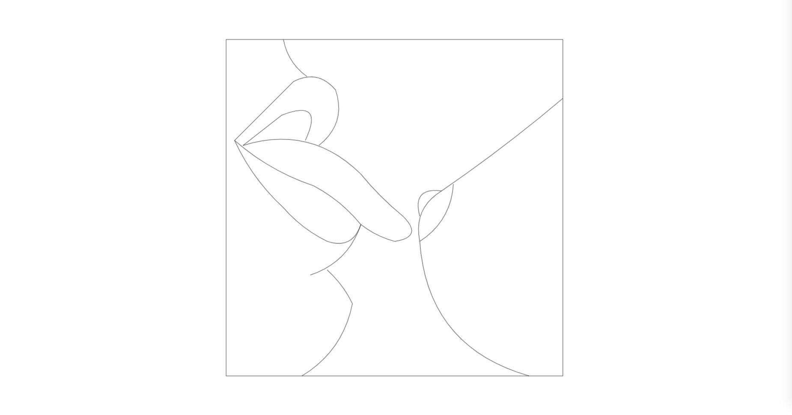
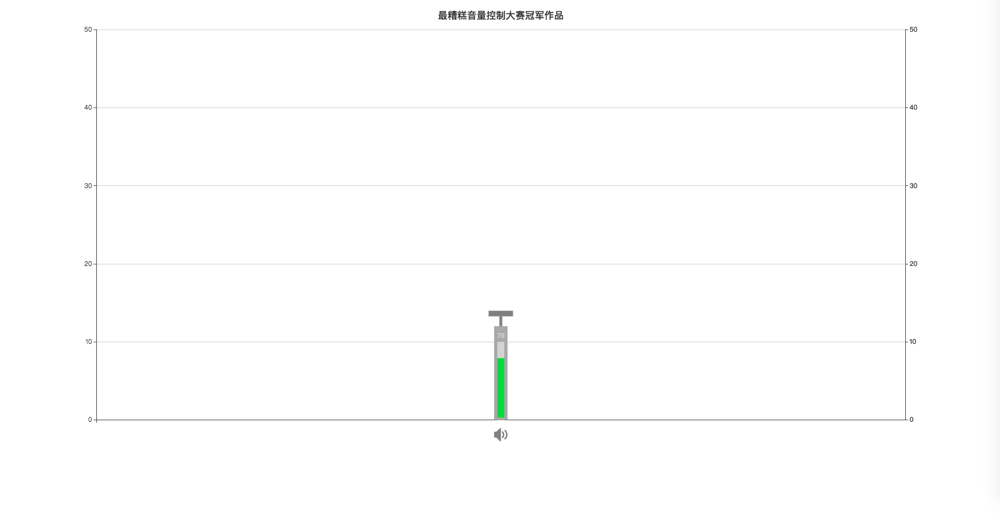
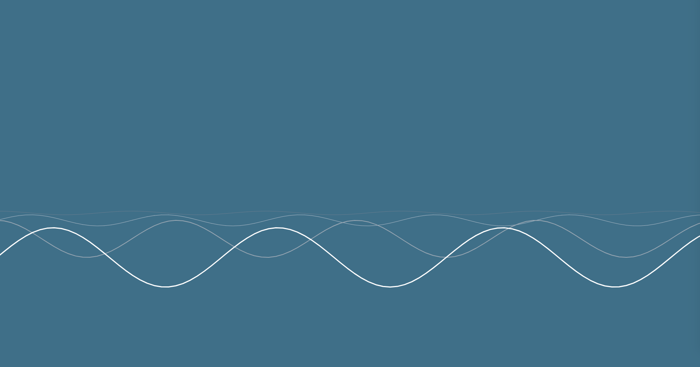
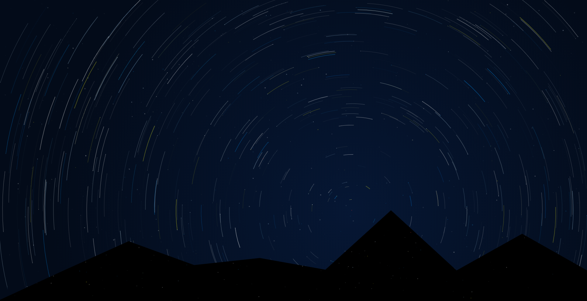

# PICS BY ECHARTS

> echarts gallery: [gallery.echartsjs.com/explore.html?u=bd-1158218442](http://gallery.echartsjs.com/explore.html?u=bd-1158218442);

> github: [https://jackshawn.github.io/pics-by-echarts/](https://jackshawn.github.io/pics-by-echarts/);


### start

```
git clone https://github.com/jackshawn/pics-by-echarts.git

cd pics-by-echarts

npm install

npm start
```

### project

```
├── dist/                                          # build path
├── src/                                           # source code
│   ├── script/                                    
│   └── style/                                     
├── img/                                           # img
├── videos/                                        # mp4
├── .gitignore
├── index.html
├── template.html                                  # template html
├── package.json
├── package-lock.json
├── webpack.config.js                              # webpack config
└── README.md

```

### preview

* city night


这个是最早抖机灵做出来的, 微博上被ECharts官博转发了, 便来劲了有了下面的

* city night 3d



* flappy bird


* lightning


* low poly animals



* mountain


* movies



* pyramid



* river



* rocket


* suck



* volume control



* wave lines



* star trails


---

最后欢迎大家star, 有作品也欢迎PR
